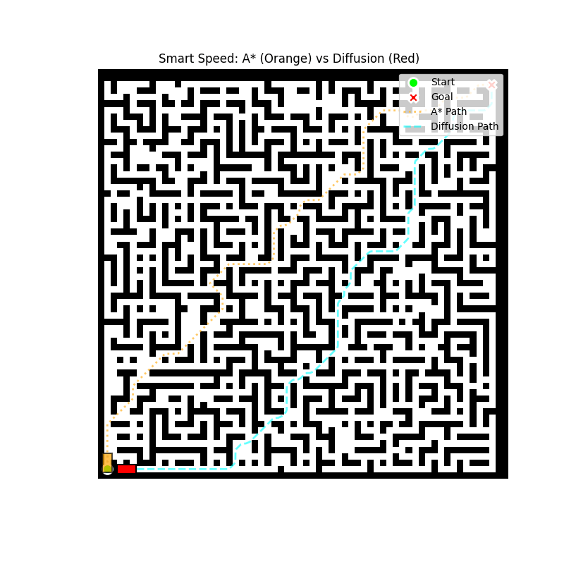
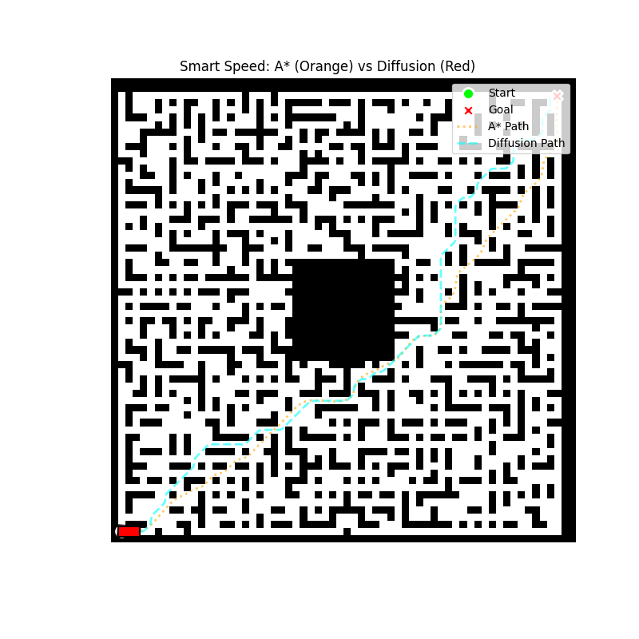
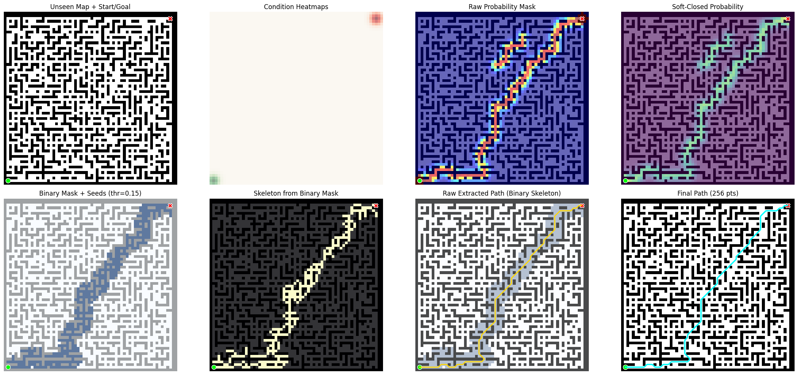

# Conditional Diffusion Models for Robot Path Planning 

Traditional grid-based planners like A* guarantee mathematically shortest paths but treat robots as point masses, often resulting in dangerous "corner-cutting" with zero safety clearance. 

This repository frames robotic path planning as a **dense image-to-image generation task**. By leveraging Denoising Diffusion Probabilistic Models (DDPM), we train a Conditional 2D Spatial U-Net to learn "safe spatial priors" from expert demonstrations. The model non-autoregressively generates smooth, centerline-aligned probability masks, which are robustly extracted into drivable trajectories.

## Key Features
* **Implicit Safety Margins:** Overcomes the zero-clearance issue of A*. The generated paths naturally concentrate in the center of free spaces, inherently maximizing obstacle clearance.
* **Kinematically-Friendly Priors:** Natively produces continuous, smooth curves without the jagged grid transitions of classical search methods, preventing frequent braking and chassis slip.
* **Robust Post-Processing Pipeline:** Implements an automated pipeline using **Distance-Field Skeletonization** and **Snake Active Contour Refinement** to extract 1-pixel-wide executable routes from continuous probability masks.
* **Map-Adaptive Kinematics:** Demonstrates a practical trade-off in real-world robotics: prioritizing physical safety and smooth velocity profiles over absolute geometric distance.

## Visual Comparison: Diffusion vs. A*

  
  
  
<i>Orange (A*): Risky geometric shortcutting. Red (Diffusion): Safer, centerline-aligned maneuver prioritizing physical clearance.</i>

## System Pipeline
1. **Conditioning:** The environment is encoded as a 3-channel tensor containing the occupancy grid, start heatmap, and goal heatmap.
2. **Reverse Denoising:** A Conditional 2D U-Net iteratively denoises a random Gaussian distribution into a path probability mask.
3. **Trajectory Extraction:** - Connectivity-First Binarization
   - Distance-Field Skeletonization
   - Active Contour (Snake) Refinement

  

